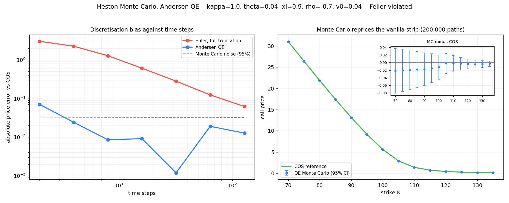
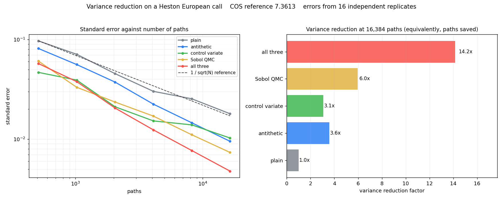
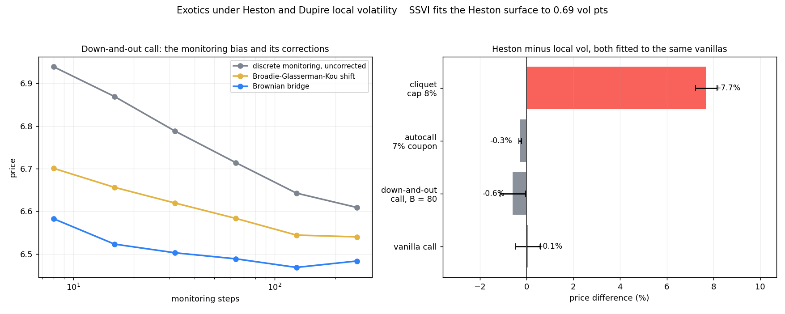

# vol-surface-engine

An arbitrage-free implied volatility surface and stochastic-volatility calibration engine, built on live Deribit option data (BTC and ETH). The goal is a small but honest replica of a derivatives desk workflow: pull the market, clean it, pin the forward from the options themselves, fit a no-arbitrage surface, calibrate a model, price exotics by Monte Carlo, and check the whole thing with a hedging backtest.

The methods (SVI/SSVI, Heston, Dupire, Monte Carlo) are model-general. Crypto options are used because the full surface is available in one public API call, with mark IVs, greeks and a per-expiry forward, which removes the usual data-access friction.

## Data

Source: the Deribit v2 public market-data API. No key is required. One call to `get_book_summary_by_currency` returns the entire option cross-section (hundreds of instruments) with best bid/ask, mark price, mark implied vol and the per-expiry underlying forward.

Two points worth stating plainly:

- Premiums are quoted in coin (BTC). A USD column is derived from the spot index for downstream pricing.
- The public API gives the current surface, not a deep history. `scripts/snapshot.py` appends each pull to a DuckDB file, so running it on a schedule builds a time series of surfaces.

The forward and discount factor are not taken from the exchange. They are recovered from put-call parity: for one expiry, `C(K) - P(K) = DF * (F - K)`, so a linear fit of call-minus-put against strike gives `DF` (minus the slope) and `F` (intercept over `DF`), and `r = -ln(DF) / T`. Deribit's own forward is kept only as a cross-check, reported in basis points by the snapshot script.

## Roadmap

The project is built in increments. Each item lands when it works and is tested.

- [x] Deribit client and tidy option chain, with DuckDB snapshots
- [x] Forward and discount from put-call parity, cross-checked against the exchange
- [x] Black-76 pricer and implied vol solver, robust in the wings
- [x] SVI per-slice fit with a butterfly no-arbitrage constraint
- [x] SSVI surface with a calendar no-arbitrage constraint
- [x] Heston characteristic function, European pricing by the COS method and Carr-Madan FFT
- [x] Heston calibration to the surface
- [x] Dupire local vol from the SVI surface, by analytic differentiation
- [x] Heston Monte Carlo with the Andersen QE scheme
- [x] Variance reduction: antithetics, control variates and Sobol
- [x] Exotics: barriers, autocallable, cliquet
- [ ] Pathwise and likelihood-ratio greeks
- [ ] Delta-hedging P&L backtest
- [ ] Optional C++ Monte Carlo core with pybind11

## Results

Slice-by-slice SVI fits to the live BTC surface: market out-of-the-money mid vols against the arbitrage-free SVI curve. Raw SVI captures the skew and the wings across maturities; the steep far call wing on some slices is where a single arbitrage-free slice is hardest to match.


Gatheral's density g(k) for the same slices stays non-negative everywhere, so each calibrated slice is free of butterfly arbitrage.


Figures are a market snapshot; regenerate them with `python scripts/plot_svi.py`.

### SSVI surface

Tying the slices into one surface with SSVI. The at-the-money variance term structure is taken from the SVI slices and forced non-decreasing, then a single set of parameters (rho, eta, gamma) is fit to the whole surface under the Gatheral-Jacquier butterfly bound eta*(1 + |rho|) <= 2. Both no-arbitrage conditions hold by construction, so the surface is arbitrage-free everywhere.


Total variance is non-decreasing in maturity at every moneyness, which is exactly the no-calendar-arbitrage condition.


One surface with three parameters is far more constrained than thirteen independent five-parameter slices, so the global fit trades some per-slice accuracy (about 3 vol points RMSE here) for a single self-consistent arbitrage-free surface. Regenerate with `python scripts/plot_ssvi.py`.

### Heston pricing

Moving from the static surface to a dynamic model. The Heston characteristic function is priced two independent ways, the COS method and the Carr-Madan FFT, and they agree to about 1e-3. The left panel is the implied vol smile the model produces (downward skew from rho < 0, flattening with maturity), priced by COS and inverted with the solver from the earlier step.


COS prices a strip of strikes in well under a millisecond, which is what makes the model fast to calibrate next. Regenerate with `python scripts/plot_heston.py`.

### Heston calibration

Fitting the five Heston parameters to the whole live surface in implied-vol space, pricing every strike by COS at each step. The fit is good at medium and long maturities but visibly struggles with the steep short-dated skew, which is the textbook limitation of one-factor Heston: matching it forces the vol of vol up until the Feller condition breaks, and it really wants jumps (Bates) instead. Shown, not hidden.


Regenerate with `python scripts/plot_heston_calibration.py`.

### Dupire local volatility

The third model: the one diffusion that reprices every vanilla exactly. Written in total variance, Dupire's denominator turns out to be exactly Gatheral's g(k) from the butterfly condition, so the formula collapses to

    sigma_loc^2 = w_T / g(k)

which makes the dependency explicit: butterfly (g >= 0) and calendar (w_T >= 0) are jointly what keep the local variance positive, and the SSVI fit enforces both. Under SSVI maturity enters only through theta(T), so w_T follows by the chain rule with dw/dtheta in closed form; theta is interpolated with PCHIP, which is C1 and monotonicity-preserving.

Deriving this from the fitted surface rather than raw quotes is the point. Dupire needs a second derivative in strike, which is unstable on noisy prices and can turn negative; on SSVI every derivative is analytic.


Local vol is close to implied at the money and roughly twice as steep in skew nearby, which is the textbook relationship. Regenerate with `python scripts/plot_dupire.py`.

### Monte Carlo, Andersen QE

Where the project stops being a surface tool and becomes a pricer. A plain Euler discretisation of the CIR variance goes negative, which breaks the square root and biases prices badly. Andersen's QE scheme samples the next variance from a distribution matched to its first two conditional moments, quadratic when the variance is high and a mass at zero plus an exponential tail when it is low. The log-spot step carries the exact martingale correction, so the simulated forward is unbiased path by path.



The parameters here violate Feller on purpose, which is the regime that hurts a naive scheme most. With eight time steps QE is off by 0.009 while full-truncation Euler is off by 1.28; Euler still has not caught up at 128 steps. Once QE reaches the Monte Carlo noise floor the remaining wiggle is sampling error, not discretisation. On the right the simulation reprices the whole vanilla strip against COS, every strike inside its confidence interval, which is what licenses using it on payoffs that have no formula.

Regenerate with `python scripts/plot_mc.py`.

### Variance reduction

Monte Carlo converges like one over the square root of the sample, which is slow. Three standard techniques are implemented, and the design that makes them fit together is that the whole simulation is driven by a fixed-dimension array of uniforms, two per time step. In the quadratic QE branch the uniform goes through the inverse normal and the exponential branch consumes it directly, so one uniform advances the variance whichever branch is taken. Antithetic sampling is then simply U to 1 - U, and quasi-Monte Carlo is simply swapping the pseudorandom uniforms for a scrambled Sobol sequence.



Measuring the gain correctly matters as much as the techniques. Antithetic paths come in negatively correlated pairs, so the independent unit is the pair average, not the path; and Sobol points are deliberately not independent, so an i.i.d. standard error is meaningless on them and the error is instead taken from the spread across independent scrambles. With the naive formula all three appear to do nothing. Measured properly they give roughly 3.6x, 3.1x and 6.0x, and 14x combined, which is the same accuracy from fourteen times fewer paths. The combined curve is also visibly steeper than the one over square root of N reference, which is the quasi-Monte Carlo rate showing through.

Control variates carry over to payoffs with no formula: pricing an arithmetic Asian call with the European call as control, whose exact mean comes from COS, cuts the variance by about 3.6x on its own.

Regenerate with `python scripts/plot_variance_reduction.py`.

### Exotics, and where two calibrated models disagree

Three products, each exposing a different issue. Barriers are where discrete monitoring bites: a simulation only checks the barrier on its grid, misses excursions in between, and so lets too many knock-outs survive. The Brownian-bridge crossing probability corrects this in expectation and is close to converged at eight steps, where the uncorrected payoff still needs a few hundred. The Broadie-Glasserman-Kou barrier shift sits in between.



The right panel is a controlled experiment and the point of the whole project. A Heston model is fixed, its own implied vol surface is generated, SSVI is fitted to that surface and Dupire local vol is read off it. The two models therefore agree on vanillas by construction, and indeed the vanilla call prices to within 0.1%. The barrier and the autocallable stay inside Monte Carlo noise. The cliquet differs by nearly 8%.

That gap is not numerical error, it is the models saying different things. A cliquet resets its strike at every observation, so it prices the *forward* smile rather than today's, and local volatility flattens its forward smile far too quickly while Heston keeps generating skew. Matching today's vanillas does not pin down the dynamics, which is exactly why a desk cares which model it books structured products in.

Regenerate with `python scripts/plot_exotics.py`.

## Layout

    src/volsurface/       black-76 pricing, implied vol, svi/ssvi surfaces, heston, dupire,
                          monte carlo, exotic payoffs
    src/volsurface/data/  market data: Deribit client, chain parsing, parity forward
    scripts/              snapshot to DuckDB, and one figure script per model step
    tests/                unit tests that run without network access

## Getting started

    python -m venv .venv && source .venv/bin/activate
    pip install -e ".[dev,plot]"

The whole pipeline, from live quotes to a local volatility, is a handful of lines:

```python
from volsurface import implied_vol_surface, ssvi, heston, dupire, mc
from volsurface.data import load_chain, forward_curve

chain = load_chain("BTC")                          # full option chain, one API call
surface = implied_vol_surface(chain, forward_curve(chain))

fit = ssvi.calibrate(surface)                      # arbitrage-free surface
fit.butterfly_ok, fit.calendar_ok                  # both True by construction

hes = heston.calibrate(surface)                    # dynamic model, ~1s
heston.price_cos(F, K, 0.0, 0.0, T, hes.params)    # price any European

dupire.local_vol(k, T, fit.params)                 # local vol at (k, T)

mc.price_european(F, K, T, hes.params)             # same price, by simulation
mc.price_european(F, K, T, hes.params,             # 14x less variance
                  method="sobol", antithetic=True, control=True)
```

Scripts that reproduce every figure above:

    python scripts/snapshot.py --currency BTC --db data/deribit_btc.duckdb
    python scripts/plot_svi.py --currency BTC
    python scripts/plot_ssvi.py --currency BTC
    python scripts/plot_heston.py
    python scripts/plot_heston_calibration.py --currency BTC
    python scripts/plot_dupire.py --currency BTC

Run the tests:

    pytest -q

## References

- Gatheral and Jacquier, Arbitrage-free SVI volatility surfaces (2014).
- Fang and Oosterlee, A novel pricing method based on Fourier-cosine series (2008).
- Andersen, Simple and efficient simulation of the Heston stochastic volatility model (2008).
- Carr and Madan, Option valuation using the fast Fourier transform (1999).
- Albrecher et al., The little Heston trap (2007).
- Glasserman, Monte Carlo Methods in Financial Engineering (2003), chapters 4 and 7.
- Broadie, Glasserman and Kou, A continuity correction for discrete barrier options (1997).
- Dupire, Pricing with a smile (1994).
- Gatheral, The Volatility Surface (2006), chapter 1.
